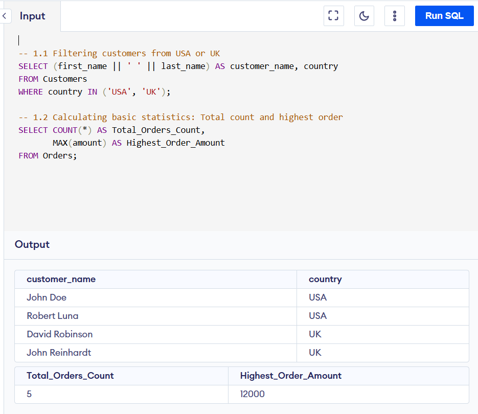
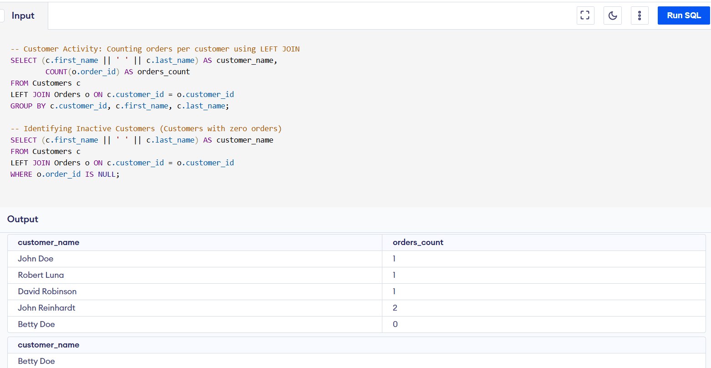
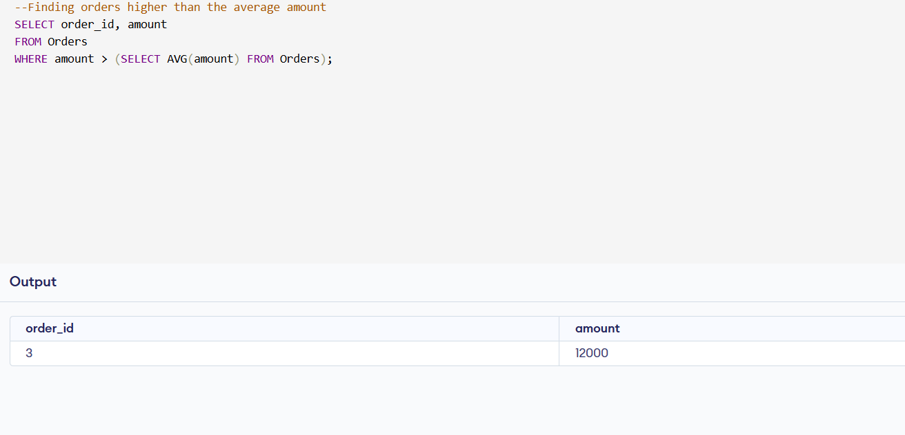

# SQL Mastery: Retail Data Analytics & Business Logic

### 📌 Project Overview
This repository contains a collection of SQL scripts designed to simulate and solve real-world retail business scenarios. The project focuses on extracting actionable insights from relational databases (Customers & Orders) using advanced querying techniques.

**Environment:** All scripts were developed and tested using the **Programiz Online Editor**.

---

## 🚀 Features
- **Complex Data Retrieval:** Advanced multi-table **Joins** and nested **Subqueries**.
- **Statistical Summaries:** Utilization of **Aggregate Functions** (SUM, AVG, COUNT) and **Grouping**.
- **Analytical Reporting:** Performance-optimized queries for real-world business scenarios.
- **Data Insight:** Transforming raw data into meaningful business intelligence via **SQL**.

---


## 🛠️ Technologies
- **SQL** (DQL & DDL)
- **Advanced Joins** (Inner, Outer, Self-Joins)
- **Analytical Functions**
- **Query Optimization**

---


### 🛠️ Technical Skillset
This project demonstrates proficiency in:
* **Data Retrieval:** Filtering multi-country data and string concatenation for clean reporting.
* **Relational Mapping:** Utilizing **INNER JOIN** and **LEFT JOIN** to link disparate data entities.
* **Aggregations & Grouping:** Calculating business KPIs like highest order amounts and customer purchase frequency.
* **Advanced Logic:** Implementing **Subqueries** for comparative analysis and **HAVING** clauses for high-density data filtering.

---

### 📂 Key Learning Modules & Visual Results

#### 1. Basic Filtering & Aggregates
* Filtering customers specifically from the USA or UK.
* Calculating basic order statistics such as `Total_Orders_Count` and `Highest_Order_Amount`.

> **📊 Execution Result:**
> 

#### 2. Relational Data Mapping (JOINS)
* Linking customers with their respective order amounts and items.
* **Customer Activity Tracking:** Identifying the number of orders per customer using `GROUP BY`.
* **Inactive Customer Analysis:** Using `LEFT JOIN` and `IS NULL` filters to find customers who haven't placed orders yet.

> **📊 Execution Result:**
> 

#### 3. Advanced Business Analytics
* **Performance Benchmarking:** Retrieving orders that are above the average order amount using subqueries.

> **📊 Execution Result:**
> 

---

### ⚠️ Technical Note: Empty Output in Market Density Analysis
In the **Market Density Analysis** section, you might notice that the query returns no rows:
```sql
SELECT country, COUNT(customer_id) AS total_customers
FROM Customers
GROUP BY country
HAVING COUNT(customer_id) > 2;
```

---


**Reason:** This is a logical filtering choice. The query specifically looks for countries with a high density of customers (more than 2). Since the current sample dataset in the environment contains 1 or 2 customers per country, the result is correctly empty. This demonstrates the ability to apply strict business rules regardless of the current data volume.
